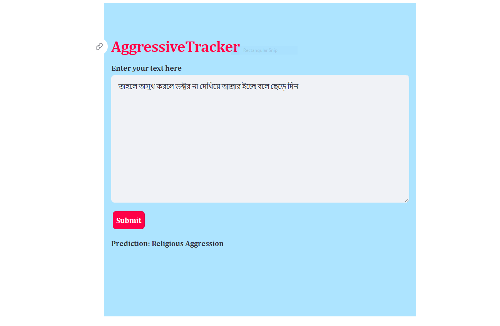

# Aggressive Text Detection App

## About

This repository contains code for an aggressive text detection app built using Streamlit. The app allows users to input Bangla text, and it predicts the aggression level of the text using a pre-trained model.

The app supports the following categories of aggression:

- Religious Aggression
- Political Aggression
- Verbal Aggression
- Gendered Aggression

## Demo

[Click here to view the demo](https://bangla-aggressive-text-detection-app.streamlit.app/)

